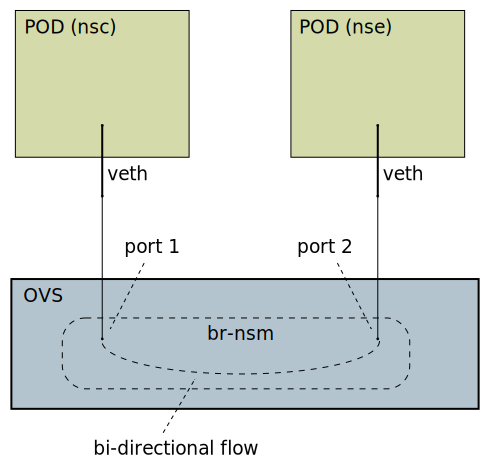

# OVS based forwarder for NSM next-gen

An OVS based forwarder for the old NSM was developed by
[EST](https://www.est.tech/) and is avalable on a NSM fork at [Nordix
github](https://github.com/Nordix/networkservicemesh/tree/ovs-forwarder).

First the function is described and a prototype version based on
[nsm-forwarder-generic](https://github.com/Nordix/nsm-forwarder-generic)
is created.

## The ovs-forwarder for NSM 1st-gen

This is the base for the NSM next-gen prototype version.

Get the code;
```
git clone --depth 1 -b ovs-forwarder https://github.com/Nordix/networkservicemesh.git
cd networkservicemesh
ls forwarder/ovs-forwarder/
```

The ovs daemons are started and supervised with
[supervisord](https://github.com/Nordix/networkservicemesh/blob/ovs-forwarder/forwarder/ovs-forwarder/build/supervisord.conf). Ovs
is configured by the
[configure-ovs.sh](https://github.com/Nordix/networkservicemesh/blob/ovs-forwarder/forwarder/ovs-forwarder/build/configure-ovs.sh)
script.

The ovs-forwarder uses a bridge named "br-nsm" initiated with;

```
ovs-vsctl -- --may-exist add-br br-nsm
ovs-ofctl del-flows br-nsm
```

### Local connection

This is the case where both PODs are on the same node.




## The ovs-forwarder next-gen prototype

The ovs backend for
[nsm-forwarder-generic](https://github.com/Nordix/nsm-forwarder-generic)
is implemented by the
[ovs.sh](../ovl/nsm/default/var/lib/networkservicemesh/ovs.sh) script.

It can be tested with;

```
xcadmin k8s_test nsm ovs > $log
```

The ovs is setup in the `init` callout. The `configure-ovs.sh` script
from the 1st gen ovs-forwarder is used without modifications.

So far only local connection is implemented.
