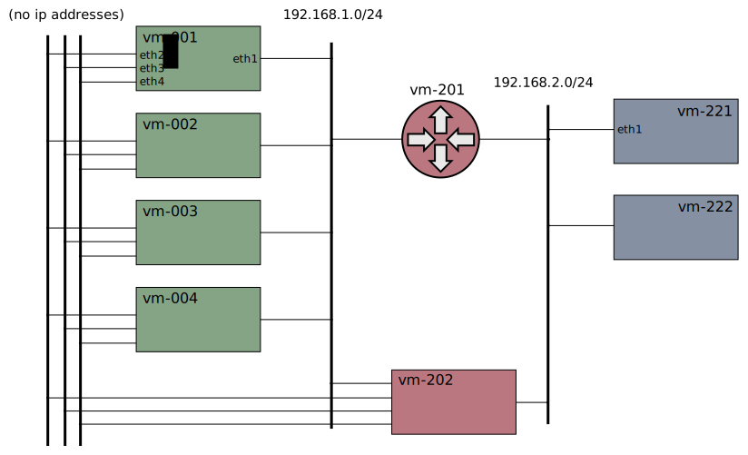

# Xcluster/ovl - nsm-vlan-dpdk

NSM with `forwarder-vpp` with vlan support and `dpdk` enabled.

A variation of the
[multilan](https://github.com/Nordix/xcluster/tree/master/ovl/network-topology#multilan) network topology is used;



Router `vm-202` is connected to the secondary networks.


**NOTE**; the dpdk tests requires a kernel with hw support so
  `xcluster` >= v6.1.0 must be used.


## Usage

Prepare;
```bash
. ./Envsettings               # Config mem and network (important!)
log=/tmp/$USER/xcluster.log   # (assumed to be set)
# Generate manifests from Meridio (only spire);
#export __meridio_dir=/your/path/to/Nordix/Meridio
./nsm-vlan-dpdk.sh generate_manifests
# Pre-load the local registry;
for n in $(images lreg_missingimages .); do
  xc lreg_cache $n
done
# Refresh local registry (when needed);
for n in $(images getimages .); do
  xc lreg_cache $n
done
```

Automatic Test;
```
# Setup vlan and ping from vm-202
./nsm-vlan-dpdk.sh test > $log
```

Check out things;
```
./nsm-vlan-dpdk.sh test --no-stop > $log
# On a vm;
cat /proc/cmdline
grep Huge /proc/meminfo
lspci
pod=$(kubectl get pods -l app=forwarder-vpp -o name | head -1)
kubectl exec -it $pod -- vppctl
show dpdk version
show pci
show int
```


## Vlan

A mapping file domain->interfaces must be provided to the
`forwarder-vpp` and passed in the `$NSM_DOMAIN_CONFIG_FILE` variable;

```
serviceDomains:
  service.domain.2:
    interfaces:
        - name: eth2
```

The NSE must define a service using the domain and a vlan-tag;
```
    - name: NSM_SERVICES
      value: "finance-bridge@service.domain.2: { vlan: 100 }"
```

And finally an NSC must use the service;
```
    - name: NSM_NETWORK_SERVICES
      value: kernel://finance-bridge/nsm-1
```

## Dpdk

Vpp in the `forwarder-vpp` is started with;
```
vpp -c /etc/vpp/helper/vpp.conf
```

Dpdk is configured in the `/etc/vpp/helper/vpp.conf` file. The
`/etc/vpp/` directory i mounted in the `forwarder-vpp` pod, and the
used file is in `default/etc/vpp/helper/vpp.conf`.


### Hugepages

Dpdk requires [hugepages](https://wiki.debian.org/Hugepages).
Hugepages must be configured in `xcluster` and also in the
`forwarder-vpp` manifest to become available inside the container. Please see the [K8s documentation](https://kubernetes.io/docs/tasks/manage-hugepages/scheduling-hugepages/).


### The iommu problem

Dpdk requires IOMMU (described [here](https://gist.github.com/mcastelino/e0cca2af5694ba672af8e274f5dffb47)).
For now that doesn't work in `xcluster`.
